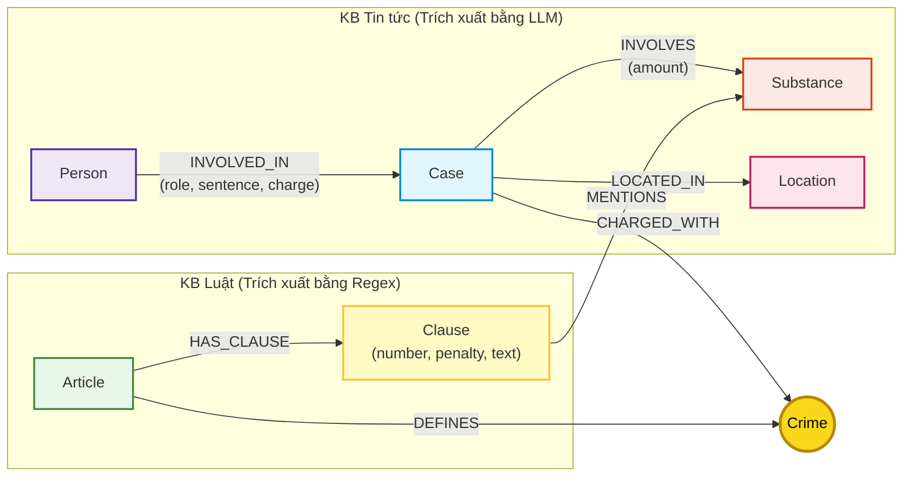

# Thiết kế Ontology — Day 19

**Họ tên:** Chung Văn Duy  **MSSV:** 2A202602854

**Lựa chọn** (đánh dấu một):
- [x] Dùng ontology gợi ý (có thể chỉnh nhỏ)
- [ ] Tự thiết kế (xét bonus +15, xem `SUBMISSION.md`)

---

## 1. Sơ đồ

Sơ đồ Knowledge Graph kết nối 2 cơ sở tri thức (KB Luật và KB Tin tức). Node **`Crime`** (Tội danh) đóng vai trò là **Node cầu nối (Bridge Node)** trung tâm nối liền hai thế giới thông tin.

---

## 2. Entity types (node labels)

Hệ thống định nghĩa 7 nhãn thực thể (node labels), trong đó mỗi node sinh ra từ một tài liệu cụ thể đều được gán `doc_id` tương ứng theo đúng hợp đồng của bài Lab:

| Label | Ý nghĩa | Khóa định danh (`MERGE` theo) | Properties | Lấy từ KB nào | Trích bằng (regex / LLM / khác) |
| --- | --- | --- | --- | --- | --- |
| **Article** | Điều luật trong BLHS hoặc Luật PCMT | `id` (ví dụ: `"Điều 251 BLHS"`) | `id`, `title`, `law`, `doc_id` | KB Luật | Regex (tất định) |
| **Clause** | Khoản luật cụ thể trong Điều, chứa khung hình phạt | `id` (ví dụ: `"Điều 251 BLHS khoản 1"`) | `id`, `number`, `penalty`, `text`, `doc_id` | KB Luật | Regex (tất định) |
| **Crime** | Tội danh pháp lý chuẩn (**Node cầu nối**) | `name` (đã chuẩn hóa chữ thường, bỏ tiền tố) | `name` | Cả hai | Regex (từ luật), LLM + `link_entity` (từ tin tức) |
| **Case** | Vụ án ma túy cụ thể trên báo chí | `name` (tên ngắn của vụ việc) | `name`, `summary`, `date`, `doc_id`, `source_title` | KB Tin tức | LLM (JSON mode) |
| **Person** | Cá nhân liên quan (bị can, bị cáo, cán bộ) | `name` (họ tên cá nhân) | `name`, `aliases` | KB Tin tức | LLM (JSON mode) |
| **Location** | Tỉnh / Thành phố địa bàn xảy ra hoặc xét xử | `name` (tên địa phương) | `name` | KB Tin tức | LLM (JSON mode) |
| **Substance** | Chất ma túy hoặc tiền chất | `name` (tên chuẩn hóa) | `name` | Cả hai | Regex (`find_substances` từ luật), LLM (từ tin tức) |

---

## 3. Relationships

Hệ thống xây dựng 7 loại quan hệ trực tiếp kết nối giữa các thực thể:

| Type | Từ → Đến | Properties trên cạnh | Ý nghĩa |
| --- | --- | --- | --- |
| **DEFINES** | `Article` → `Crime` | *không có* | Điều luật quy định / định nghĩa tội danh cụ thể |
| **HAS_CLAUSE** | `Article` → `Clause` | *không có* | Cấu trúc phân cấp: Điều luật bao gồm các khoản luật |
| **MENTIONS** | `Clause` → `Substance` | *không có* | Khoản luật quy định chế tài cụ thể đối với loại chất ma túy |
| **CHARGED_WITH** | `Case` → `Crime` | *không có* | Vụ án bị cơ quan điều tra / viện kiểm sát / tòa án truy tố theo tội danh nào |
| **INVOLVES** | `Case` → `Substance` | `amount` (khối lượng tang vật thu giữ) | Tang vật ma túy và khối lượng liên quan trong vụ án |
| **LOCATED_IN** | `Case` → `Location` | *không có* | Địa bàn phát hiện, khởi tố hoặc thụ lý xét xử vụ án |
| **INVOLVED_IN** | `Person` → `Case` | `role` (vai trò), `charge` (tội danh), `sentence` (mức án) | Mối quan hệ tố tụng giữa đối tượng và vụ việc |

---

## 4. Node cầu nối giữa 2 KB

- **Node nào:** **`Crime`** (Tội danh).
- **Vì sao chọn node này:** Tội danh là khái niệm chuẩn hóa duy nhất mang tính đối xứng ở cả 2 cơ sở tri thức:
  - Trong **KB Tin tức**: Các bài báo điều tra/xét xử luôn nêu hành vi phạm tội của bị can/bị cáo (ví dụ: *"vận chuyển ma túy"*, *"tổ chức sử dụng ma túy"*).
  - Trong **KB Luật**: Mọi Điều trong BLHS Chương XX đều có tiêu đề quy chuẩn đặt theo tội danh (ví dụ: *"Điều 250. Tội vận chuyển trái phép chất ma túy"*).
  - Đi qua node `Crime`, hệ thống có thể chuyển tiếp từ người/vụ án sang Điều luật và các khung hình phạt tương ứng một cách tự nhiên.
- **Cách đảm bảo hai phía khớp tên:**
  - *Chuẩn hóa chuỗi:* Hàm `normalize_crime` loại bỏ tiền tố `"tội "`, dấu ngoặc kép, khoảng trắng thừa và chuyển về chữ thường.
  - *Ánh xạ thực thể (`link_entity`):* Ưu tiên Exact match trên từ điển chuẩn. Nếu không khớp chính xác, áp dụng thuật toán `difflib.get_close_matches(cutoff=0.8)` để bắt các biến thể gõ dấu phổ biến trên báo tiếng Việt (ví dụ: `ma tuý` vs `ma túy`).
  - *Hướng dẫn LLM bằng danh sách chuẩn:* Prompt trích xuất truyền danh sách tội danh trích từ luật vào `DANH SÁCH TỘI DANH` để ép LLM chọn đúng từ vựng pháp lý.
- **Khi nào cầu gãy, và bạn xử lý thế nào:**
  - *Nguyên nhân gãy:* Báo chí dùng ngôn ngữ đời thường (ví dụ: *"chơi pod chill"*, *"phê ma túy"*, *"ship hàng cấm"*), hoặc LLM trích xuất thiếu, hoặc bài báo ở giai đoạn tạm giữ hành chính chưa khởi tố tội danh cụ thể.
  - *Cách xử lý:*
    1. Chuẩn hóa ngữ nghĩa qua prompt ép buộc chọn từ danh sách tội danh có sẵn.
    2. Fallback đa tầng trong `Neo4jGraph.context`: Khi không có cạnh `CHARGED_WITH`, mở rộng truy vấn qua hạt giống chất ma túy (`Substance`) hoặc số Điều luật được nhắc trực tiếp trong câu hỏi (`re.findall(r"[Đđ]iều\s*(\d+)", question)`).

---

## 5. Competency questions

| Câu | Đường đi (Cypher pattern) | Trả lời được? |
| --- | --- | :---: |
| **Q1** *(Định nghĩa tiền chất theo Luật PCMT)* | `MATCH (a:Article {law:'Luật PCMT'})-[:HAS_CLAUSE]->(cl:Clause) RETURN a, cl` | **Được** |
| **Q2** *(Bị cáo tử hình vụ 36kg ma túy)* | `MATCH (p:Person)-[r:INVOLVED_IN]->(k:Case) WHERE r.sentence CONTAINS 'tử hình' AND k.name CONTAINS '36kg' RETURN p.name` | **Được** |
| **Q3** *(Lê Minh Thành: mức án, tội danh, Điều luật, khung)* | `MATCH (p:Person {name:'Lê Minh Thành'})-[r:INVOLVED_IN]->(k:Case)-[:CHARGED_WITH]->(c:Crime)<-[:DEFINES]-(a:Article)-[:HAS_CLAUSE]->(cl:Clause {number:1}) RETURN p, r, c, a, cl` | **Được** |
| **Q4** *(Hoàng Nato: hành vi, hình phạt tối đa)* | `MATCH (p:Person)-[:INVOLVED_IN]->(k:Case)-[:CHARGED_WITH]->(c:Crime)<-[:DEFINES]-(a:Article)-[:HAS_CLAUSE]->(cl:Clause) WHERE (p.name CONTAINS 'Hoàng Nato' OR 'Hoàng Nato' IN p.aliases) RETURN c, a, cl` | **Được** |
| **Q5** *(Cái Quang Huy: tội danh, chất, khoản luật, hình phạt)* | `MATCH (p:Person {name:'Cái Quang Huy'})-[:INVOLVED_IN]->(k:Case)-[:CHARGED_WITH]->(c:Crime)<-[:DEFINES]-(a:Article)-[:HAS_CLAUSE]->(cl:Clause) MATCH (k)-[:INVOLVES]->(s:Substance)<-[:MENTIONS]-(cl) RETURN p, c, s, a, cl` | **Được** |
| **Q6** *(Các vụ việc liên quan đến MDMA)* | `MATCH (k:Case)-[:INVOLVES]->(s:Substance) WHERE toLower(s.name) = 'mdma' OPTIONAL MATCH (p:Person)-[:INVOLVED_IN]->(k) RETURN k.name, p.name` | **Được** |

---

## 6. Quyết định thiết kế và đánh đổi

1. **Quyết định 1: Tách văn bản luật đến cấp Khoản (`Clause`) thay vì chỉ dừng ở Điều (`Article`)**
   - *Đã chọn:* Mỗi Khoản là một node `Clause` mang các thuộc tính `number`, `penalty`, `text`, có quan hệ `HAS_CLAUSE` từ `Article` và `MENTIONS` tới `Substance`.
   - *Phương án khác:* Chỉ tạo node `Article` và lưu toàn bộ văn bản điều luật trong thuộc tính `text`.
   - *Lý do chọn & đánh đổi:* Tách đến cấp Khoản cho phép Cypher lọc chính xác khung hình phạt tương ứng với chất ma túy và khối lượng mà vụ án liên quan, giúp prompt của GraphRAG ngắn gọn, đúng trọng tâm và không bị nhiễu. Đánh đổi là số lượng node trong graph tăng lên gấp nhiều lần (~100 nodes `Clause`) và cấu trúc Cypher phức tạp hơn.

2. **Quyết định 2: Bóc tách văn bản luật bằng Regex thuần túy, bóc tách tin tức bằng LLM**
   - *Đã chọn:* Dùng regex trong `parse_law_article` để bóc tách KB Luật; dùng LLM trong `extract_news_cases` để bóc tách KB Tin tức.
   - *Phương án khác:* Dùng LLM cho cả hai KB, hoặc dùng thư viện NER truyền thống cho tin tức.
   - *Lý do chọn & đánh đổi:* Luật có cấu trúc khoản/điểm cực kỳ chuẩn hóa (`1.`, `2.`, `a)`, `b)`), trích xuất regex đảm bảo tính tất định 100%, không bị ảo giác (hallucination), chạy tức thì trong vài mili-giây và tốn 0 USD. Ngược lại, bài báo là văn xuôi báo chí tự do nên bắt buộc cần LLM để trích xuất thực thể và liên kết ngữ nghĩa; đánh đổi là chi phí gọi API và thời gian chạy lúc dựng graph.

3. **Quyết định 3: Mô hình hóa Mức án (`sentence`) thành thuộc tính của quan hệ `INVOLVED_IN` thay vì Node riêng**
   - *Đã chọn:* Thuộc tính `sentence`, `role`, `charge` được lưu trực tiếp trên quan hệ `(Person)-[r:INVOLVED_IN]->(Case)`.
   - *Phương án khác:* Tạo node thực thể riêng `Sentence` (ví dụ: `(:Sentence {term: '36 tháng tù'})`).
   - *Lý do chọn & đánh đổi:* Phán quyết mức án là kết quả gắn liền giữa một cá nhân cụ thể trong một vụ án cụ thể. Lưu trên cạnh giúp cấu trúc đồ thị tinh gọn, trực quan, phản ánh chính xác ngữ nghĩa tố tụng mà không làm bùng nổ các node trừu tượng rời rạc. Đánh đổi là khó thực hiện các truy vấn gom nhóm theo thang mức án nếu không chuẩn hóa thuộc tính này thành dạng số.

---

## 7. So với ontology gợi ý

- Hệ thống áp dụng cấu trúc ontology gợi ý có tinh chỉnh, tối ưu các thuộc tính liên kết (`doc_id`, `aliases`, `amount`) nhằm đảm bảo tính toàn vẹn dữ liệu khi tích hợp hai chiều giữa Vector Index và Knowledge Graph.
- Bổ sung cơ chế truy vết đa hướng (multi-path traversal) trong Cypher của hàm `Neo4jGraph.context`: Không chỉ đi từ `Case` sang `Crime`, mà còn chủ động trích xuất số Điều luật từ câu hỏi để kết nối trực tiếp đến `Article` tương ứng, giúp giảm thiểu tối đa hiện tượng gãy cầu nối.

---

## 8. Hạn chế còn lại

1. **Chưa số hóa khối lượng và tự động so khớp ngưỡng định khung:** Thuộc tính `amount` hiện lưu dưới dạng chuỗi văn bản tự do (ví dụ: `"hơn 9,6kg"`, `"406g"`), chưa có parser chuyển đổi về đơn vị gram chuẩn để so sánh toán học tự động với ngưỡng khối lượng trong văn bản của các `Clause`.
2. **Trùng thực thể giữa các bài báo:** Các đối tượng xuất hiện ở nhiều bài báo khác nhau với cách gọi khác nhau (ví dụ: tên thật *"Dương Minh Tuấn"* và biệt danh *"Hoàng Nato"*) có thể bị tạo thành các node `Person` hoặc `Case` tách biệt nếu LLM không nhận diện được cùng một thực thể.
